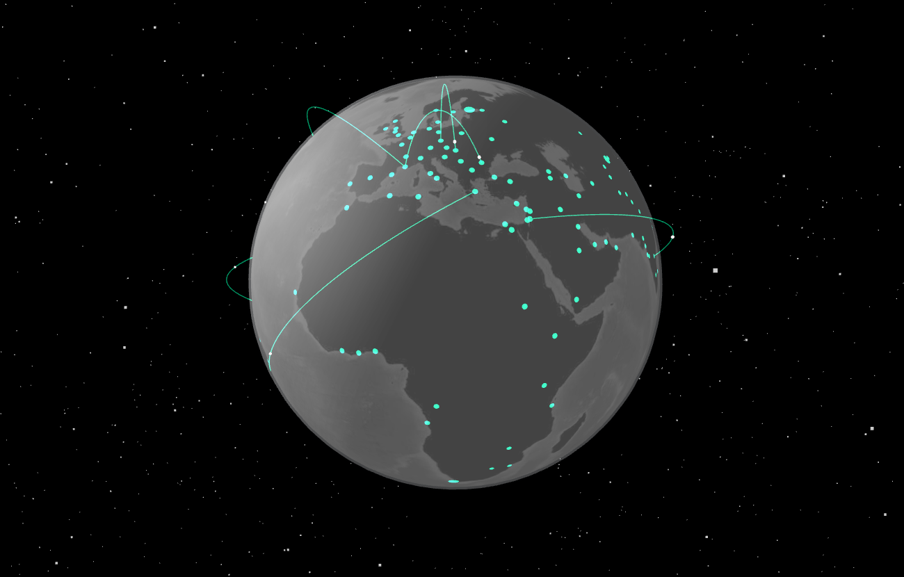

# Global Internet Flow Visualization

An interactive 3D visualization of simulated global internet traffic flow using Three.js and WebGL. This project showcases nodes representing major cities worldwide and simulates data packets traveling between them.

## Features

*   Interactive 3D globe with realistic textures (Earth, clouds, atmosphere).
*   Dynamic nodes representing geographic locations.
*   Simulated traffic flow between nodes using animated arcs and packets.
*   Orbit controls for rotating and zooming.
*   Adjustable number of visible nodes via UI controls.
*   Responsive design for various screen sizes.

## Technologies Used

*   HTML5
*   CSS3
*   JavaScript (ES Modules)
*   [Three.js](https://threejs.org/) (for 3D rendering)
*   [OrbitControls](https://threejs.org/docs/#examples/en/controls/OrbitControls) (for camera interaction)

## Controls

*   **Rotate:** Click and drag the mouse.
*   **Zoom:** Use the mouse scroll wheel.
*   **Adjust Nodes:** Use the slider or number input in the controls panel (click the gear icon to show/hide) and click "Reset Sim".

## Credits

Developed by **Junior Rumiche**.

*   [Portfolio](https://junior-rumiche.vercel.app/)
